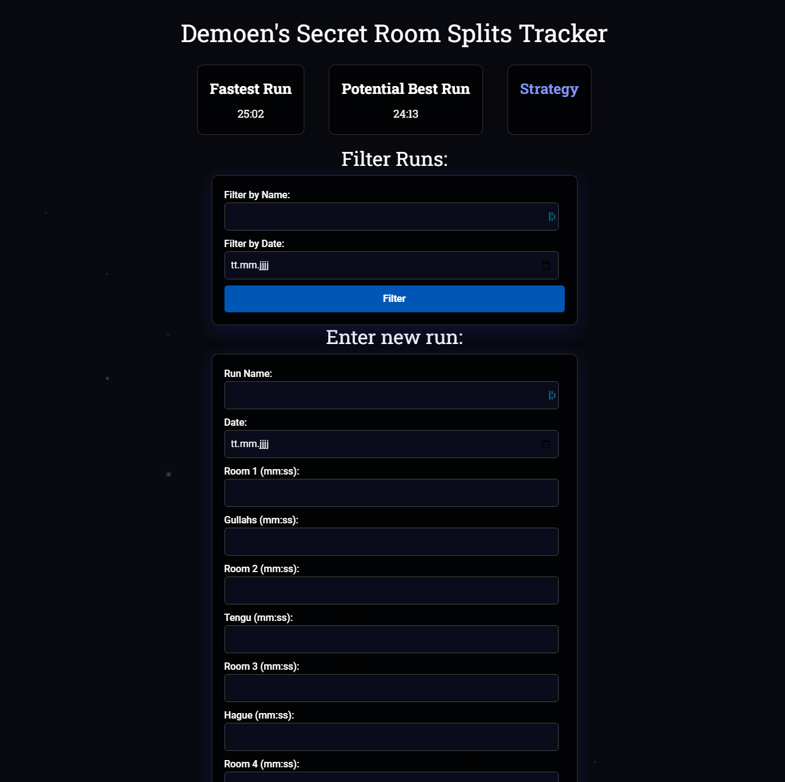
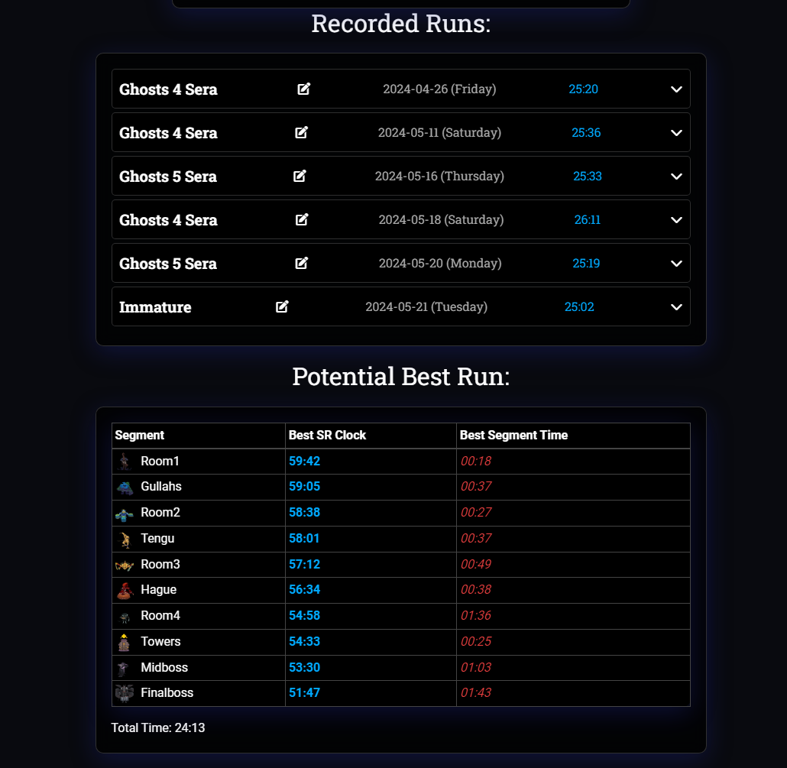
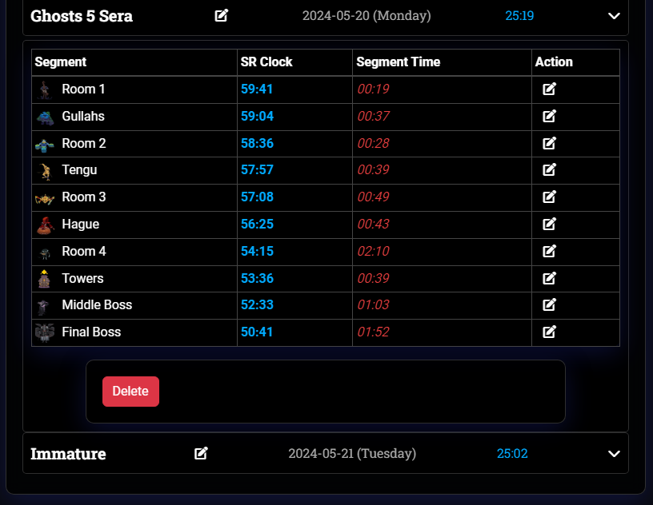

# Secret Room Splits Tracker

The Secret Room Splits Tracker is a web application designed to help speedrunners track their progress through various stages of a game. This project includes a Flask-based backend, HTML templates for the frontend, and a SQLite database for storing data.







## Features

- **Track Progress:** Log and monitor your progress through different game stages.
- **Visual Feedback:** View images related to each stage to assist with navigation and tracking.
- **User-Friendly Interface:** Simple and intuitive web interface built with HTML templates.

## Project Structure

```
Secret Room Splits Tracker/
├── .git/
├── images/
│   ├── finalboss.png
│   ├── gullahs.png
│   ├── hague.png
│   ├── midboss.png
│   ├── room1.png
│   ├── room2.png
│   ├── room3.png
│   ├── room4.png
│   ├── tengu.png
│   ├── towers.png
├── templates/
│   ├── index.html
├── app.py
├── speedrun.db
└── test.zip
```

### Files and Directories

- **`.git/`**: Contains Git version control system files.
- **`images/`**: Directory with images used in the application.
- **`templates/`**: HTML templates for the web interface.
- **`app.py`**: The main Flask application script.
- **`speedrun.db`**: SQLite database file.

## Getting Started

### Prerequisites

- Python 3.x
- Flask
- SQLite

### Installation

1. **Clone the repository:**
   ```bash
   git clone https://github.com/yourusername/splits-tracker.git
   cd splits-tracker
   ```

2. **Create and activate a virtual environment:**
   ```bash
   python -m venv venv
   source venv/bin/activate
   ```

3. **Install the required packages:**
   ```bash
   pip install Flask
   ```

4. **Run the application:**
   ```bash
   export FLASK_APP=app.py
   flask run
   ```

5. **Open your browser and go to:**
   ```
   http://127.0.0.1:5000
   ```

## Usage

- Use the web interface to log your progress through the different stages of the game.
- Images will be displayed for each stage to assist you.
- Your progress is stored in the `speedrun.db` SQLite database.

## Contributing

1. Fork the repository
2. Create your feature branch (`git checkout -b feature/awesome-feature`)
3. Commit your changes (`git commit -m 'Add some awesome feature'`)
4. Push to the branch (`git push origin feature/awesome-feature`)
5. Open a pull request

## License

This project is licensed under the MIT License. See the [LICENSE](LICENSE) file for details.

## Acknowledgements

- Thanks to the speedrunning community for their input and feedback.
